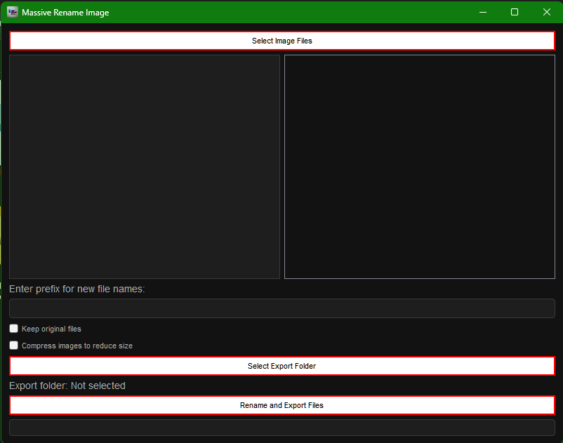

# Massive Rename Image  
Developed by Iván Ayub

**Massive Rename Image** is an intuitive graphical tool, developed in Python using PyQt5, that allows for efficient batch renaming and management of images. With a modern and user-friendly interface, it is ideal for both professionals and casual users who are looking for a quick and effective solution to organize images.

---

## Download
[Click here to download the EXE application from Google Drive (.zip)](https://drive.google.com/file/d/113C2WpqlTU-OAN21zZmZ19Z7hznRpIND/view?usp=sharing)

For inquiries or feedback, contact me at: [sellocasadenubes@gmail.com](mailto:sellocasadenubes@gmail.com).  

---

## Description  
**Massive Rename Image** combines advanced batch renaming functionality with a smooth and attractive user experience. It is designed to make image organization easier, enabling users to manage large quantities of files in a fast and simple manner.

---

## Features  
- **Multiple Image Selection:** Allows selecting multiple image files for simultaneous processing.  
- **Integrated Preview:** View selected images directly in the application.  
- **Batch Renaming:** Automatically renames image files with a custom prefix, and optionally with a suffix or sequential numbering.  
- **Preserve Original Files:** Option to keep the original files unchanged.  
- **Export Folder:** Easily select the destination folder for renamed images.  
- **Progress Bar:** Displays real-time progress during the renaming process.

---

## How to Use  

1. **Select Images:** Click the **"Select Image Files"** button to choose the images you want to rename.  
2. **Preview the Images:** Select an image from the list to view it in the integrated preview.  
3. **Enter a Prefix:** Type the prefix you want to add to the new file names.  
4. **Select Export Folder:** Click **"Select Export Folder"** to choose the location where the renamed images will be saved.  
5. **Rename Images:** Click **"Rename and Export Files"** to start the renaming process.  
6. **Monitor Progress:** Watch the progress in the status bar during the operation.

### Example Scenario  
If you have a folder with vacation photos, you can rename all of them with a prefix like **"Vacation_2024"** to make them easier to search and organize.

---

## System Requirements  
- **Operating System:** Windows.  
- **Python:** Version 3.6 or higher.  
- **Dependencies:**  
  - PyQt5  

---

## Captures

---

## Development & Contribution
### Credits  
This software uses the powerful [PyQt5](https://pypi.org/project/PyQt5/) library to create a feature-rich graphical interface. The following Python libraries are also used:  
- **os:** For interacting with the operating system.  
- **sys:** Access to system-specific parameters and functions.  
- **shutil:** For file and directory operations.  
- **PyQt5.QtCore:** Key functionalities such as threads and signals.  
- **PyQt5.QtGui:** Manages graphics, including icons.  
- **PyQt5.QtWidgets:** Used to build the graphical interface, including buttons, labels, and dialogs.  

### Contributions  
We welcome contributions! To contribute:
1. Fork the repository.
2. Make your changes.
3. Submit a pull request.

---

Enjoy using Massive Rename Image! Your feedback is invaluable and helps us improve continuously.